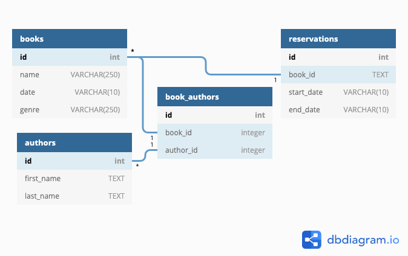

# 6-sam-ameer-books
LINK:https://herokudatabasebooks.herokuapp.com/

## Founders & Coders book sharing system
As a member of Founders & Coders who has a book I would like to share...
- I can add a book to the database
- Remove a book if it is lost, destroyed or broken

If I want to borrow a book
- I can browse for available books:
    - Search using a text input
    - search using a category filter
    - search by availability
- I can use a reservation feature
    - I can reserve a book for certain dates (add my name as the renter)
    - I can unreserve a book

## Basic App Schema

---

## Requirements
- Simple web app with a node server and a database
- Your database comes with a schema, which should be documented in your readme (along with any other architectural decisions)
- Database hosted on Heroku, or locally
- Build script for your database
- Security concerns appropriately considered (you must protect against script injections!)
- Content dynamic, but DOM manipulation kept to a minimum
- Mobile-first design
- Clear user journey (even if you take one of our suggested ideas, document the user journey in your readme)
- test your server routes with supertest
- test your pure functions both server and client side
- set up a test database so that you can test your database queries

---

## Stretch goals:
- Books can simultaneously be reserved by multiple users but for different dates
- I can rate the book after I've read it
- GoodReads API - Display photo, ratings, details of book.
- Multiple copies of books possible
- Add a comment on the book
- I can see details of an author and all the books they have written
- extra search fields:
    - release date
    - popularity
    - search by author
    - book length
- I can create a page that lists my favourite books.
